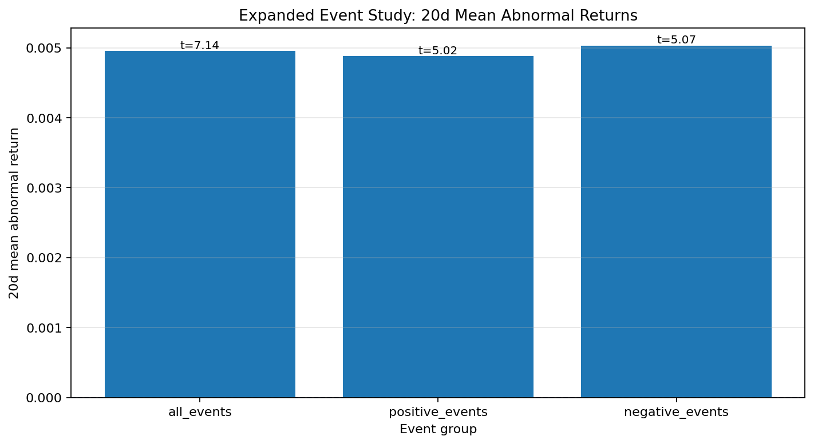
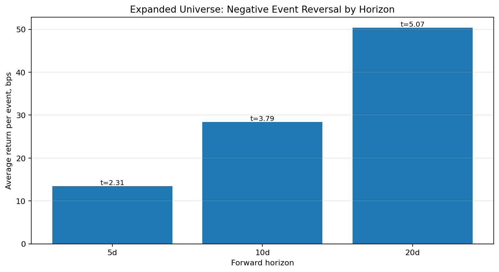
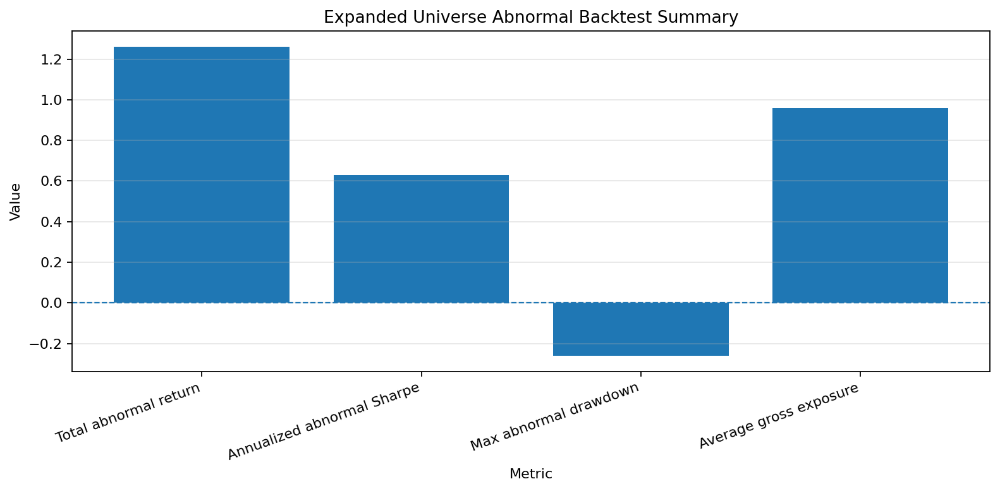
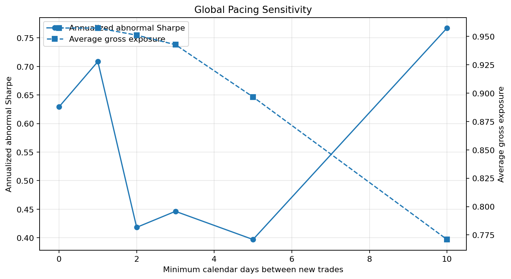
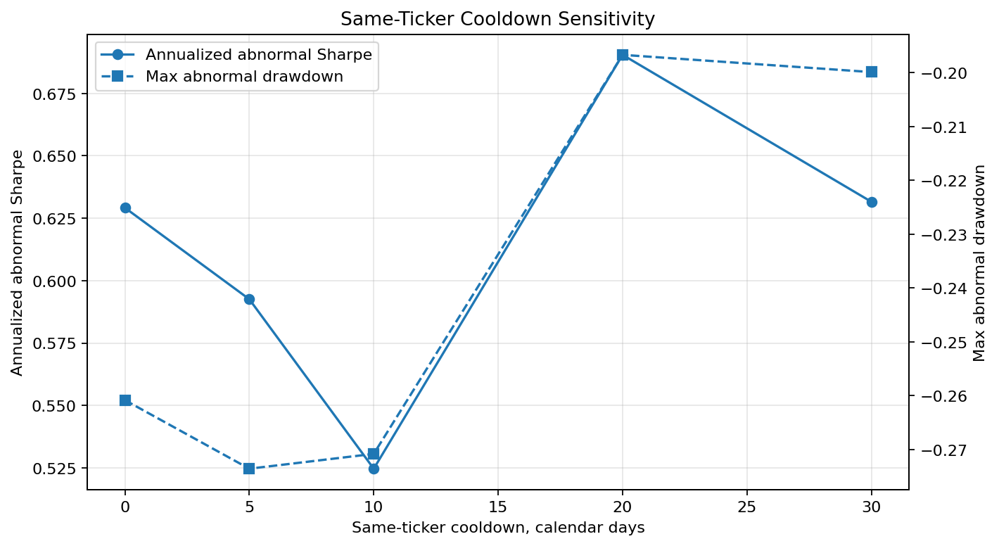
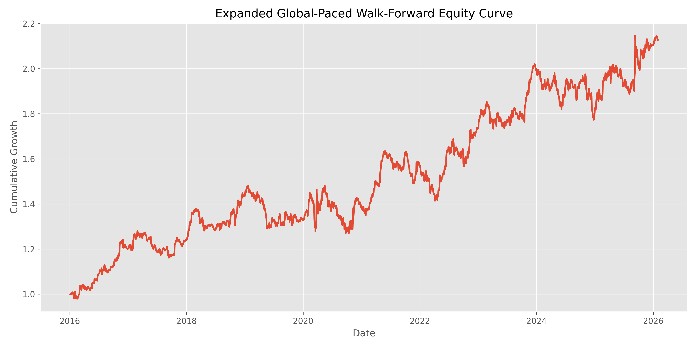
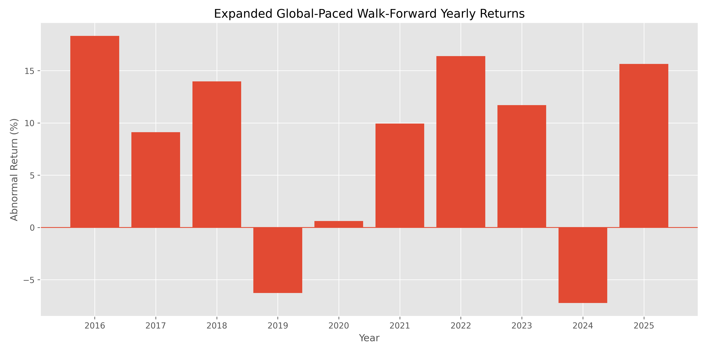
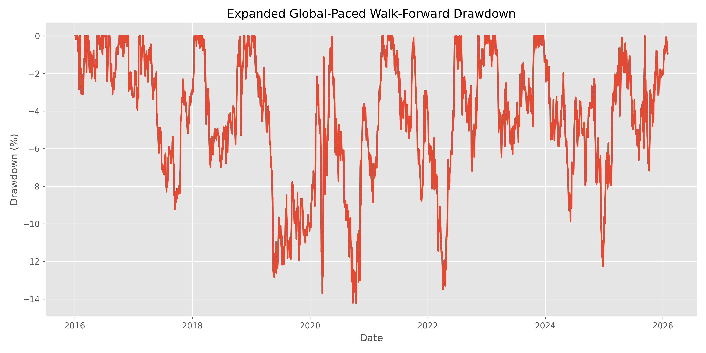
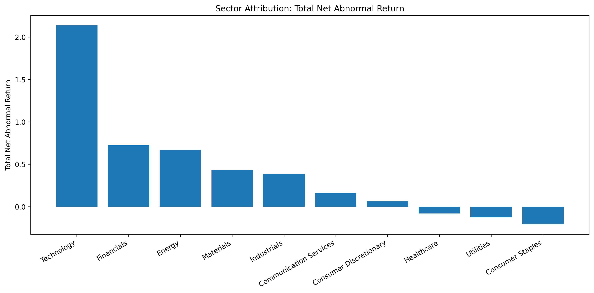
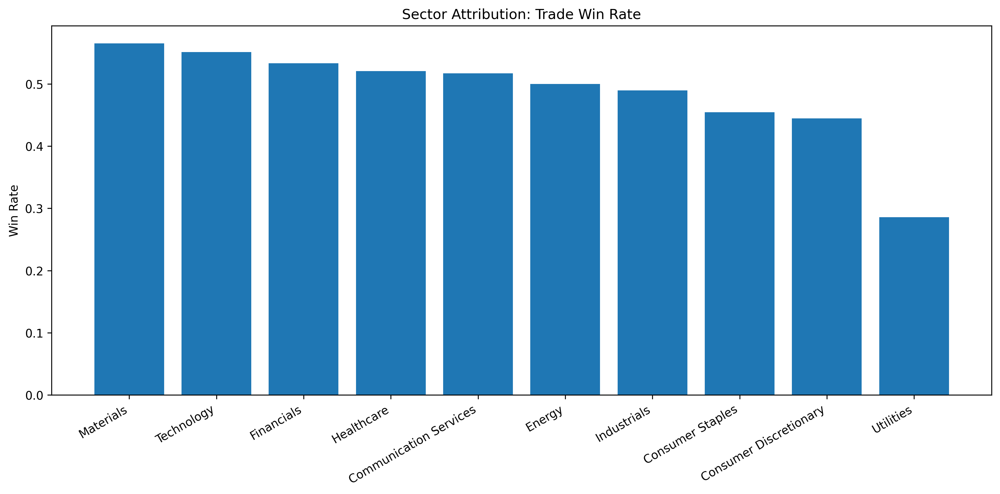

# Event-Driven Equity Risk Lab


A systematic equity research project studying whether large stock-level information shocks create persistent post-event abnormal returns.

Full research write-up: [research/report.md](research/report.md)

The project focuses on **event-driven equity behaviour**, not broad market-regime allocation. Each observation is a `ticker + event_date` pair, and the core question is whether stocks drift or reverse after abnormal price-volume events.

## Research Question

When do equity events produce tradable post-event abnormal returns, and when does the apparent signal disappear after transaction costs, liquidity constraints, placebo baselines, exposure controls, or walk-forward validation?

## Core Finding

The strongest current result is an asymmetric event effect:

> Negative abnormal price-volume events show a medium-term reversal pattern.

The project began as a 10-stock MVP and was later expanded to an 88-stock liquid US equity universe. The negative-event reversal effect survived this universe expansion, but the larger universe also revealed an important deployment issue: without pacing, the strategy becomes almost continuously invested.

The most realistic expanded-universe result currently comes from adding a global trade-pacing rule and validating it year by year.

| Metric | Expanded Global-Paced Walk-Forward Result |
|---|---:|
| Universe size | 88 stocks |
| Event panel | 12,266 events |
| Strategy | Negative Event Reversal |
| Test period | 2016-2025 |
| Holding period | 30 trading days |
| Transaction cost | 5 bps per side |
| Max concurrent positions | 5 |
| Global pacing | Minimum 10 calendar days between new trades |
| Trades | 327 |
| Win rate | 51.38% |
| Average trade abnormal return | 1.27% |
| Median trade abnormal return | 0.13% |
| Total abnormal return | 112.73% |
| Annualized abnormal Sharpe | 0.73 |
| Max abnormal drawdown | -14.21% |
| Average gross exposure | 77.43% |

All strategy returns above are abnormal returns, calculated as:

```text
stock return - SPY return
```

The expanded walk-forward result is positive overall, but not positive every year. The main weak years were 2019 and 2024, which reinforces the need for failure-mode analysis rather than treating the signal as universal.

## Key Figures

### Expanded Event Study: 20d Mean Abnormal Returns



### Expanded Universe: Negative Event Reversal by Horizon



### Expanded Universe Abnormal Backtest Summary



### Global Pacing Sensitivity



### Same-Ticker Cooldown Sensitivity



### Expanded Global-Paced Walk-Forward Equity Curve



### Expanded Global-Paced Walk-Forward Yearly Returns



### Expanded Global-Paced Walk-Forward Drawdown



### Optimized Walk-Forward Equity Curve


### Optimized Walk-Forward Yearly Returns


### Optimized Walk-Forward Drawdown


### Holding Period Sensitivity


### Transaction Cost Sensitivity


### Threshold Sensitivity


### Sector Attribution: Total Net Abnormal Return



### Sector Attribution: Trade Win Rate



## Current Best Strategy Candidate

| Component | Rule |
|---|---|
| Strategy | Negative Event Reversal |
| Universe | 88 liquid US equities |
| Event type | Negative abnormal price-volume event |
| Event threshold | `event_strength <= -2.0` |
| Volume confirmation | `volume_shock >= 1.2` |
| Holding period | 30 trading days |
| Return stream | Stock return minus SPY return |
| Transaction cost | 5 bps per side |
| Positioning | Equal-weighted active positions |
| Position cap | Max 5 concurrent positions |
| Exposure control | Minimum 10 calendar days between new trades globally |

## Methodology

### 1. Data Pipeline

The project starts with daily price and volume data for a liquid US equity universe, plus SPY as the market benchmark.

The initial MVP universe contained 10 large-cap stocks:

```text
AAPL, MSFT, NVDA, AMZN, META, GOOGL, JPM, XOM, JNJ, HD
```

The expanded universe currently contains 88 liquid US equities across technology, financials, healthcare, consumer, industrials, energy, materials, utilities, and communication services.

Benchmark:

```text
SPY
```

The dataset currently spans:

```text
2015-01-02 to 2026-05-22
```

Generated data is ignored by Git and can be rebuilt by running the pipeline.

### 2. Event Detection

For each stock, the project computes daily abnormal returns:

```text
abnormal_return_i,t = stock_return_i,t - SPY_return_t
```

Then it computes event strength:

```text
event_strength_i,t = abnormal_return_i,t / rolling_20d_abnormal_vol_i,t
```

The baseline negative event definition is:

```text
event_strength <= -2.0
volume_shock >= 1.2
avg_20d_dollar_volume >= 50,000,000
```

where:

```text
volume_shock = current_volume / trailing_20d_avg_volume
```

Rolling baselines are shifted by one day to avoid using event-day information in pre-event estimates.

### 3. Expanded Event Study

The expanded event panel contains:

| Metric | Value |
|---|---:|
| Events | 12,266 |
| Positive events | 6,244 |
| Negative events | 6,022 |
| Tickers | 88 |
| Date range | 2015-02-03 to 2026-04-24 |

Expanded 20-day event-study results:

| Group | Events | 20d Mean Abnormal Return | 20d Hit Rate | 20d t-stat |
|---|---:|---:|---:|---:|
| All events | 12,266 | 0.50% | 51.56% | 7.14 |
| Positive events | 6,244 | 0.49% | 51.44% | 5.02 |
| Negative events | 6,022 | 0.50% | 51.68% | 5.07 |

The signal weakened in magnitude compared with the original 10-stock MVP, but the expanded sample is much broader and more statistically credible.

### 4. Directional Drift and Reversal

The project separates continuation from reversal.

For a positive event, drift means the future abnormal return is positive.

For a negative event, reversal means the future abnormal return is positive after an initial negative shock.

The expanded event-type analysis still selected:

```text
Negative Event Reversal
```

Best candidate by horizon:

| Horizon | Strategy | Events | Mean Return | Avg bps/event | Hit Rate | t-stat |
|---:|---|---:|---:|---:|---:|---:|
| 5d | Negative Event Reversal | 6,022 | 0.134% | 13.41 bps | 50.76% | 2.31 |
| 10d | Negative Event Reversal | 6,022 | 0.284% | 28.41 bps | 51.59% | 3.79 |
| 20d | Negative Event Reversal | 6,022 | 0.503% | 50.34 bps | 51.68% | 5.07 |

This is important because the original thesis survived expansion from 10 stocks to 88 stocks.

### 5. Placebo Testing

The project uses placebo tests to check whether detected events are special.

#### Random Placebo

Random stock-date placebo events performed similarly to real events in some cases, which weakened the first broad interpretation.

#### Matched Placebo

A stricter matched placebo sampled non-event dates from the same ticker and same year.

Matched placebo result for the original negative-event reversal candidate:

| Strategy | Horizon | Real | Matched Placebo | Difference |
|---|---:|---:|---:|---:|
| Negative Event Reversal | 20d | 0.82% | 0.51% | 30.3 bps |

This showed that negative event reversal was stronger than same-stock, same-year non-event baselines in the MVP study.

### 6. Backtesting

The first raw backtest used stock returns. A stricter version used abnormal returns:

```text
daily abnormal return = stock daily return - SPY daily return
```

The expanded 88-stock abnormal-return backtest produced:

| Metric | Result |
|---|---:|
| Universe size | 88 |
| Trades | 457 |
| Win rate | 52.52% |
| Average trade abnormal return | 1.00% |
| Median trade abnormal return | 0.48% |
| Total abnormal return | 126.16% |
| Annualized abnormal Sharpe | 0.63 |
| Max abnormal drawdown | -26.08% |
| Active day ratio | 99.20% |
| Average gross exposure | 95.74% |

This result showed that the signal survived expansion, but it also exposed a major issue: the naive expanded-universe strategy became almost continuously invested.

### 7. Cost Sensitivity

The original transaction cost sensitivity test showed that the strategy survived moderate transaction cost assumptions.

| Cost per Side | Round Trip | Avg Trade Abnormal Return | Total Abnormal Return | Sharpe |
|---:|---:|---:|---:|---:|
| 1 bps | 2 bps | 0.91% | 124.50% | 0.77 |
| 5 bps | 10 bps | 0.83% | 108.70% | 0.70 |
| 10 bps | 20 bps | 0.73% | 90.51% | 0.62 |
| 25 bps | 50 bps | 0.43% | 44.89% | 0.38 |
| 50 bps | 100 bps | -0.07% | -8.20% | -0.03 |

Interpretation:

> The edge survives moderate costs but fails under very high slippage.

### 8. Holding Period Sensitivity

The original holding-period sensitivity test showed that the reversal effect was strongest at a 30-trading-day holding window.

| Hold | Trades | Avg Trade Abnormal Return | Total Abnormal Return | Sharpe | Max Drawdown |
|---:|---:|---:|---:|---:|---:|
| 5d | 632 | 0.05% | 3.22% | 0.08 | -22.46% |
| 10d | 572 | 0.33% | 42.69% | 0.40 | -17.51% |
| 20d | 456 | 0.83% | 108.70% | 0.70 | -22.68% |
| 30d | 362 | 1.86% | 267.66% | 1.18 | -13.16% |
| 60d | 208 | 1.82% | 96.57% | 0.56 | -17.25% |

Interpretation:

> The effect appears to be medium-term rather than a quick bounce.

### 9. Threshold Sensitivity

The best original threshold was the balanced baseline setting:

```text
event_strength <= -2.0
volume_shock >= 1.2
```

| Event Strength | Volume Shock | Trades | Avg Trade Abnormal Return | Total Abnormal Return | Sharpe | Max Drawdown |
|---:|---:|---:|---:|---:|---:|---:|
| 1.5 | 1.0 | 427 | 0.95% | 110.93% | 0.57 | -25.69% |
| 2.0 | 1.2 | 362 | 1.86% | 267.66% | 1.18 | -13.16% |
| 2.5 | 1.5 | 241 | 1.37% | 87.49% | 0.67 | -22.24% |
| 3.0 | 2.0 | 133 | 1.47% | 47.89% | 0.57 | -10.84% |
| 3.5 | 2.5 | 80 | -0.10% | -0.28% | 0.02 | -11.34% |

Interpretation:

> Too-loose thresholds dilute the signal, while very extreme events may represent genuine repricing rather than temporary overreaction.

### 10. Risk Filter Analysis

Several simple filters were tested in the original MVP analysis:

- exclude XOM
- exclude 2022
- exclude extreme event strength
- cap volume shock
- combine practical filters

None clearly beat the baseline on risk-adjusted performance.

| Filter | Trades | Avg Trade Abnormal Return | Sharpe | Max Drawdown |
|---|---:|---:|---:|---:|
| Baseline | 362 | 1.86% | 1.18 | -13.16% |
| Exclude XOM | 343 | 1.97% | 1.15 | -23.53% |
| Exclude 2022 | 330 | 1.73% | 1.10 | -13.16% |
| Exclude extreme strength > 6 | 357 | 1.87% | 1.16 | -14.35% |
| Cap volume shock at 3 | 353 | 1.75% | 1.08 | -13.82% |
| Practical combined filter | 331 | 2.06% | 1.14 | -23.53% |

Interpretation:

> The baseline remains the cleanest rule. Extra filters risk overfitting.

### 11. Cooldown Sensitivity

After expanding to 88 stocks, same-ticker cooldowns were tested to reduce repeated clustered entries.

| Cooldown | Accepted Trades | Avg Trade Return | Sharpe | Max Drawdown | Avg Gross Exposure |
|---:|---:|---:|---:|---:|---:|
| 0d | 457 | 1.00% | 0.63 | -26.08% | 95.74% |
| 5d | 454 | 0.93% | 0.59 | -27.36% | 95.11% |
| 10d | 453 | 0.80% | 0.52 | -27.08% | 94.90% |
| 20d | 453 | 1.06% | 0.69 | -19.67% | 94.90% |
| 30d | 452 | 0.92% | 0.63 | -19.99% | 94.69% |

A 20-day same-ticker cooldown improved drawdown and Sharpe, but it did not fix the exposure problem because the broader universe still produced enough events to keep the portfolio almost fully invested.

### 12. Global Pacing Sensitivity

Global pacing directly controls how often the strategy can add new trades across the entire universe.

| Min Days Between New Trades | Accepted Trades | Avg Trade Return | Sharpe | Max Drawdown | Avg Gross Exposure |
|---:|---:|---:|---:|---:|---:|
| 0 | 457 | 1.00% | 0.63 | -26.08% | 95.74% |
| 1 | 457 | 1.08% | 0.71 | -23.28% | 95.74% |
| 2 | 454 | 0.63% | 0.42 | -20.55% | 95.11% |
| 3 | 450 | 0.70% | 0.45 | -21.22% | 94.27% |
| 5 | 428 | 0.68% | 0.40 | -25.76% | 89.66% |
| 10 | 368 | 1.39% | 0.77 | -14.19% | 77.10% |

The 10-calendar-day global pacing rule was the best current realism layer. It improved risk-adjusted performance, reduced drawdown, and lowered gross exposure.

### 13. Expanded Global-Paced Walk-Forward Validation

The expanded global-paced walk-forward test applies the current best fixed rule year by year from 2016 to 2025.

Fixed rule:

```text
event_strength <= -2.0
volume_shock >= 1.2
hold = 30 trading days
transaction cost = 5 bps per side
max concurrent positions = 5
minimum 10 calendar days between new trades globally
```

Full expanded global-paced walk-forward result:

| Metric | Result |
|---|---:|
| Test period | 2016-2025 |
| Trades | 327 |
| Win rate | 51.38% |
| Average trade abnormal return | 1.27% |
| Median trade abnormal return | 0.13% |
| Total abnormal return | 112.73% |
| Annualized abnormal Sharpe | 0.73 |
| Max abnormal drawdown | -14.21% |
| Average gross exposure | 77.43% |

Yearly results:

| Year | Trades | Abnormal Return | Sharpe | Max Drawdown |
|---:|---:|---:|---:|---:|
| 2016 | 34 | 18.32% | 1.66 | -4.76% |
| 2017 | 33 | 9.11% | 1.00 | -9.24% |
| 2018 | 33 | 13.97% | 1.46 | -6.99% |
| 2019 | 33 | -6.28% | -0.58 | -13.26% |
| 2020 | 31 | 0.62% | 0.12 | -14.19% |
| 2021 | 33 | 9.95% | 0.99 | -8.80% |
| 2022 | 31 | 16.39% | 1.34 | -8.55% |
| 2023 | 33 | 11.70% | 1.17 | -6.44% |
| 2024 | 33 | -7.23% | -0.67 | -10.60% |
| 2025 | 33 | 15.65% | 1.09 | -7.17% |

This is the strongest validation layer in the project so far because it combines the expanded universe, fixed rules, abnormal returns, transaction costs, global pacing, and year-by-year walk-forward testing.

The result is positive overall, but not positive every year. The weak years were 2019 and 2024, which highlights that the strategy has real failure modes and should not be presented as a universal anomaly.

### 14. Earlier Fixed-Rule Walk-Forward Validation

The earlier fixed-rule yearly test used:

```text
event_strength <= -2.0
volume_shock >= 1.2
hold = 30 trading days
```

Full fixed-rule walk-forward result:

| Metric | Result |
|---|---:|
| Test period | 2016-2025 |
| Trades | 325 |
| Win rate | 57.54% |
| Average trade abnormal return | 1.95% |
| Median trade abnormal return | 1.33% |
| Total abnormal return | 247.95% |
| Annualized abnormal Sharpe | 1.26 |
| Max abnormal drawdown | -9.30% |

The fixed rule produced positive abnormal returns in every yearly test slice under the earlier research setup.

### 15. Earlier Optimized Walk-Forward Validation

For each test year, parameters were selected using only prior years.

Candidate grid:

| Parameter | Values |
|---|---|
| Event strength threshold | 1.5, 2.0, 2.5, 3.0 |
| Volume shock threshold | 1.0, 1.2, 1.5, 2.0 |
| Holding period | 10, 20, 30 |

Full optimized walk-forward result:

| Metric | Result |
|---|---:|
| Test period | 2018-2025 |
| Trades | 254 |
| Win rate | 57.09% |
| Average trade abnormal return | 1.81% |
| Median trade abnormal return | 1.20% |
| Total abnormal return | 140.63% |
| Annualized abnormal Sharpe | 1.03 |
| Max abnormal drawdown | -10.71% |

The optimized strategy was positive in every test year from 2018 to 2025.

| Year | Abnormal Return | Sharpe |
|---:|---:|---:|
| 2018 | 6.49% | 0.54 |
| 2019 | 16.68% | 1.69 |
| 2020 | 2.23% | 0.24 |
| 2021 | 17.12% | 1.76 |
| 2022 | 0.84% | 0.13 |
| 2023 | 21.78% | 1.88 |
| 2024 | 17.59% | 1.56 |
| 2025 | 12.01% | 1.22 |

Parameter selection was stable. The 30-day holding period was selected every year.

## Failure Modes

The strategy is not universal. Its main failure modes are:

| Failure Mode | Mechanism |
|---|---|
| Genuine repricing | Some negative events are not overreactions but the start of a real decline |
| Ticker heterogeneity | Performance is uneven across stocks |
| Weak walk-forward years | 2019 and 2024 were negative in the expanded global-paced walk-forward test |
| Cost drag | The strategy fails under very high transaction cost assumptions |
| Over-filtering | Very strict event thresholds reduce the trade set and can remove the edge |
| Persistent exposure | The expanded universe creates too many events unless pacing is added |
| Event clustering | Repeated events can keep the portfolio almost continuously invested |

## Repository Structure

```text
event-driven-equity-risk-lab/
│
├── README.md
├── requirements.txt
├── .gitignore
│
├── src/
│   ├── universe.py
│   ├── data.py
│   ├── events.py
│   ├── analysis.py
│   ├── validation.py
│   ├── signals.py
│   ├── directional_analysis.py
│   ├── event_type_analysis.py
│   ├── placebo.py
│   ├── matched_placebo.py
│   ├── backtest.py
│   ├── backtest_abnormal.py
│   ├── backtest_validation.py
│   ├── cost_sensitivity.py
│   ├── holding_period_sensitivity.py
│   ├── threshold_sensitivity.py
│   ├── risk_filter_analysis.py
│   ├── cooldown_sensitivity.py
│   ├── global_pacing_sensitivity.py
│   ├── walk_forward.py
│   ├── walk_forward_optimized.py
│   ├── walk_forward_expanded_paced.py
│   ├── final_summary.py
│   ├── figures.py
│   └── expanded_figures.py
│
├── tests/
│   ├── conftest.py
│   └── test_core_logic.py
│
├── .github/
│   └── workflows/
│       └── tests.yml
│
├── docs/
│   └── figures/
│
├── research/
│   └── report.md
│
├── data/
│   ├── raw/
│   └── processed/
│
└── results/
```

Generated `data/` and `results/` outputs are ignored by Git. Selected figures are tracked under `docs/figures/` for README display.

## How to Run

Create and activate a virtual environment:

```powershell
py -m venv .venv
Set-ExecutionPolicy -Scope Process -ExecutionPolicy RemoteSigned
.\.venv\Scripts\Activate.ps1
```

Install dependencies:

```powershell
pip install -r requirements.txt
```

Run tests:

```powershell
pytest
```

Run the main pipeline:

```powershell
python src\data.py
python src\events.py
python src\analysis.py
python src\validation.py
python src\event_type_analysis.py
python src\backtest_abnormal.py
python src\cooldown_sensitivity.py
python src\global_pacing_sensitivity.py
python src\walk_forward_expanded_paced.py
python src\expanded_figures.py
```

Run additional research modules:

```powershell
python src\signals.py
python src\directional_analysis.py
python src\placebo.py
python src\matched_placebo.py
python src\backtest.py
python src\backtest_validation.py
python src\cost_sensitivity.py
python src\holding_period_sensitivity.py
python src\threshold_sensitivity.py
python src\risk_filter_analysis.py
python src\walk_forward.py
python src\walk_forward_optimized.py
python src\final_summary.py
python src\figures.py
```

## Current Limitations

This is still an MVP research project.

Key limitations:

1. The expanded universe is larger but still manually selected.
2. Event detection is based on abnormal price-volume shocks, not actual earnings dates yet.
3. The strategy still has meaningful exposure even after global pacing.
4. Sector neutrality has not yet been implemented.
5. Results are heterogeneous across tickers and years.
6. The expanded global-paced walk-forward is fixed-rule only and does not yet include parameter re-selection using prior years.
7. The test suite currently covers core logic, but not the full research pipeline.
8. The abnormal-return model uses SPY adjustment only, not beta-adjusted, sector-adjusted, or factor-adjusted returns.

## Sector Attribution Analysis

Sector attribution analysis was performed on the expanded global-paced walk-forward trade ledger.

Main findings:

| Sector | Observation |
|---|---|
| Technology | Strongest overall contributor |
| Financials | Strong secondary contributor |
| Energy | High-return but lower-consistency sector |
| Materials | Strong hit rate and positive total return |
| Industrials | Mildly positive overall |
| Utilities | Structurally weak |
| Consumer Staples | Negative overall contribution |

The reversal effect appears strongest in cyclical, volatile, and sentiment-sensitive sectors such as Technology, Financials, Energy, and Materials.

Defensive sectors such as Utilities and Consumer Staples performed materially worse.

This suggests the signal is not purely a mega-cap technology artifact, but instead may be linked to temporary liquidity shocks and sentiment overreactions that occur more strongly in cyclical sectors.

## Next Steps

Planned improvements:

1. Add sector classification and sector attribution analysis.
2. Add actual earnings announcement dates and earnings surprise data.
3. Add sector-neutral attribution and sector-adjusted abnormal returns.
4. Compare SPY-adjusted, beta-adjusted, sector-adjusted, and factor-adjusted abnormal returns.
5. Improve exposure control through monthly trade budgets or volatility targeting.
6. Add more tests for:
   - data loading
   - event-study outputs
   - walk-forward parameter selection
   - figure generation
7. Add parameter re-selection under the expanded-universe global-pacing framework.

## Key Takeaway

The project does not assume post-event drift exists. It tests the effect through event studies, placebo controls, abnormal-return backtests, cost sensitivity, parameter sensitivity, exposure controls, and walk-forward validation.

The current evidence supports a narrower finding:

> Negative abnormal price-volume events tend to reverse over a medium-term horizon. The effect survives expansion from 10 stocks to 88 liquid US equities, but naive deployment becomes too continuously invested. A 10-calendar-day global pacing rule improves the risk profile, and the expanded global-paced walk-forward remains positive over 2016-2025 despite weak years in 2019 and 2024.

This is an event-driven equity research project, not a market-regime allocation project.