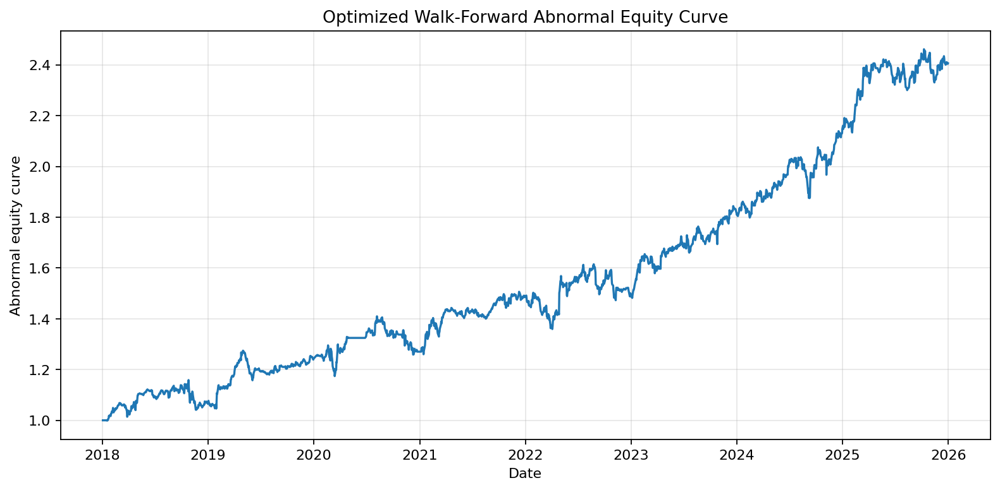
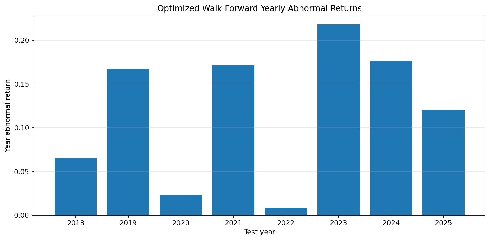
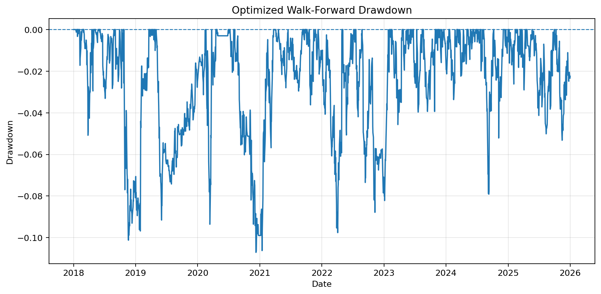
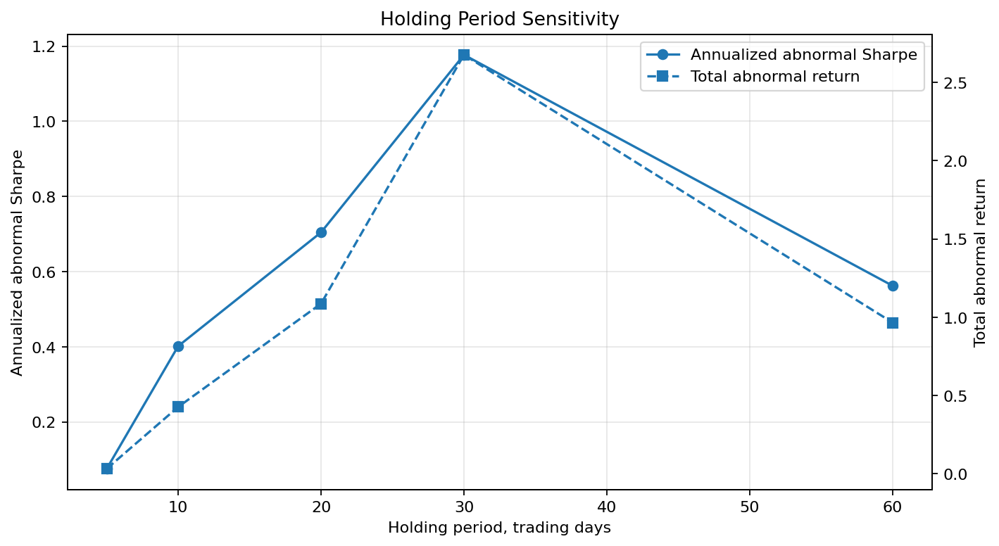
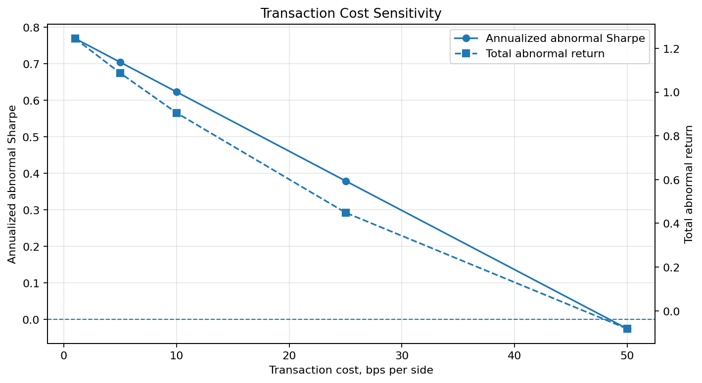
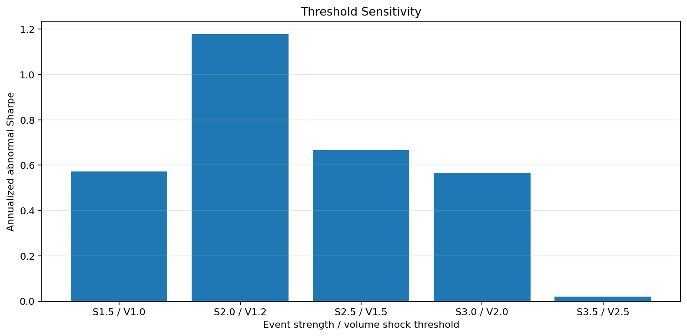

# Event-Driven Equity Risk Lab

A systematic equity research project studying whether large stock-level information shocks create persistent post-event abnormal returns.

The project focuses on **event-driven equity behaviour**, not broad market-regime allocation. Each observation is a `ticker + event_date` pair, and the core question is whether stocks drift or reverse after abnormal price-volume events.

## Research Question

When do equity events produce tradable post-event abnormal returns, and when does the apparent signal disappear after transaction costs, liquidity constraints, placebo baselines, or failure-mode conditions?

## Core Finding

The strongest current result is an asymmetric event effect:

> Negative abnormal price-volume events show a medium-term reversal pattern.

A strategy that buys after negative abnormal price-volume events and holds for around 30 trading days produced positive SPY-adjusted abnormal returns in both fixed-rule and optimized walk-forward validation.

The current best out-of-sample-style result is the optimized walk-forward test from 2018 to 2025:

| Metric | Result |
|---|---:|
| Trades | 254 |
| Win rate | 57.09% |
| Average trade abnormal return | 1.81% |
| Median trade abnormal return | 1.20% |
| Total abnormal return | 140.63% |
| Annualized abnormal Sharpe | 1.03 |
| Max abnormal drawdown | -10.71% |

All returns above are abnormal returns, calculated as:

```text
stock return - SPY return
```

and include 5 bps per side transaction costs.

## Key Figures

### Optimized Walk-Forward Equity Curve



### Optimized Walk-Forward Yearly Returns



### Optimized Walk-Forward Drawdown



### Holding Period Sensitivity



### Transaction Cost Sensitivity



### Threshold Sensitivity



## Current Best Strategy Candidate

| Component | Rule |
|---|---|
| Strategy | Negative Event Reversal |
| Event type | Negative abnormal price-volume event |
| Event threshold | `event_strength <= -2.0` |
| Volume confirmation | `volume_shock >= 1.2` |
| Holding period | 30 trading days |
| Return stream | Stock return minus SPY return |
| Transaction cost | 5 bps per side |
| Positioning | Equal-weighted active positions |
| Position cap | Max 5 concurrent positions |

## Methodology

### 1. Data Pipeline

The project starts with daily price and volume data for a liquid large-cap equity universe, plus SPY as the market benchmark.

The initial MVP universe is:

```text
AAPL, MSFT, NVDA, AMZN, META, GOOGL, JPM, XOM, JNJ, HD
```

Benchmark:

```text
SPY
```

The dataset currently spans:

```text
2015-01-02 to 2026-05-22
```

### 2. Event Detection

For each stock, the project computes daily abnormal returns:

```text
abnormal_return_i,t = stock_return_i,t - SPY_return_t
```

Then it computes event strength:

```text
event_strength_i,t = abnormal_return_i,t / rolling_20d_abnormal_vol_i,t
```

The baseline negative event definition is:

```text
event_strength <= -2.0
volume_shock >= 1.2
avg_20d_dollar_volume >= 50,000,000
```

where:

```text
volume_shock = current_volume / trailing_20d_avg_volume
```

Rolling baselines are shifted by one day to avoid using event-day information in pre-event estimates.

### 3. Event Study

The event panel contains one row per detected stock-event pair.

The first event panel contained:

| Metric | Value |
|---|---:|
| Events | 1,448 |
| Positive events | 774 |
| Negative events | 674 |
| Tickers | 10 |
| Date range | 2015-02-12 to 2026-04-24 |

Initial 20-day event-study results:

| Group | 20d Mean Abnormal Return | 20d Hit Rate | 20d t-stat |
|---|---:|---:|---:|
| All events | 0.80% | 53.45% | 4.37 |
| Positive events | 0.79% | 52.45% | 3.06 |
| Negative events | 0.82% | 54.60% | 3.13 |

This raw result showed that abnormal price-volume events were followed by positive average abnormal returns, but it did not by itself prove alpha.

### 4. Directional Drift and Reversal

The project then separated event continuation from reversal.

For a positive event, drift means the future abnormal return is positive.

For a negative event, drift means the future abnormal return is negative.

This revealed that the event effect is asymmetric:

| Event Type | 20d Behaviour |
|---|---|
| Positive events | Continuation / drift |
| Negative events | Rebound / reversal |

The most promising candidate became:

```text
Negative Event Reversal
```

meaning:

```text
buy after a large negative abnormal price-volume event
```

### 5. Placebo Testing

The project uses placebo tests to check whether detected events are special.

#### Random Placebo

Random stock-date placebo events performed similarly to real events, which weakened the first broad interpretation.

#### Matched Placebo

A stricter matched placebo sampled non-event dates from the same ticker and same year.

Matched placebo result for negative-event reversal:

| Strategy | Horizon | Real | Matched Placebo | Difference |
|---|---:|---:|---:|---:|
| Negative Event Reversal | 20d | 0.82% | 0.51% | 30.3 bps |

This showed that negative event reversal was stronger than same-stock, same-year non-event baselines.

### 6. Backtesting

The first raw backtest used stock returns. A stricter version used abnormal returns:

```text
daily abnormal return = stock daily return - SPY daily return
```

The 20-day abnormal-return backtest produced:

| Metric | Result |
|---|---:|
| Trades | 456 |
| Win rate | 54.61% |
| Average trade abnormal return | 0.83% |
| Total abnormal return | 108.70% |
| Annualized abnormal Sharpe | 0.70 |
| Max abnormal drawdown | -22.68% |

This showed that the strategy did not collapse after removing broad market exposure.

### 7. Cost Sensitivity

The strategy survived moderate transaction cost assumptions.

| Cost per Side | Round Trip | Avg Trade Abnormal Return | Total Abnormal Return | Sharpe |
|---:|---:|---:|---:|---:|
| 1 bps | 2 bps | 0.91% | 124.50% | 0.77 |
| 5 bps | 10 bps | 0.83% | 108.70% | 0.70 |
| 10 bps | 20 bps | 0.73% | 90.51% | 0.62 |
| 25 bps | 50 bps | 0.43% | 44.89% | 0.38 |
| 50 bps | 100 bps | -0.07% | -8.20% | -0.03 |

Interpretation:

> The edge survives moderate costs but fails under very high slippage.

### 8. Holding Period Sensitivity

The reversal effect was strongest at a 30-trading-day holding window.

| Hold | Trades | Avg Trade Abnormal Return | Total Abnormal Return | Sharpe | Max Drawdown |
|---:|---:|---:|---:|---:|---:|
| 5d | 632 | 0.05% | 3.22% | 0.08 | -22.46% |
| 10d | 572 | 0.33% | 42.69% | 0.40 | -17.51% |
| 20d | 456 | 0.83% | 108.70% | 0.70 | -22.68% |
| 30d | 362 | 1.86% | 267.66% | 1.18 | -13.16% |
| 60d | 208 | 1.82% | 96.57% | 0.56 | -17.25% |

Interpretation:

> The effect appears to be medium-term rather than a quick bounce.

### 9. Threshold Sensitivity

The best threshold was the balanced baseline setting:

```text
event_strength <= -2.0
volume_shock >= 1.2
```

| Event Strength | Volume Shock | Trades | Avg Trade Abnormal Return | Total Abnormal Return | Sharpe | Max Drawdown |
|---:|---:|---:|---:|---:|---:|---:|
| 1.5 | 1.0 | 427 | 0.95% | 110.93% | 0.57 | -25.69% |
| 2.0 | 1.2 | 362 | 1.86% | 267.66% | 1.18 | -13.16% |
| 2.5 | 1.5 | 241 | 1.37% | 87.49% | 0.67 | -22.24% |
| 3.0 | 2.0 | 133 | 1.47% | 47.89% | 0.57 | -10.84% |
| 3.5 | 2.5 | 80 | -0.10% | -0.28% | 0.02 | -11.34% |

Interpretation:

> Too-loose thresholds dilute the signal, while very extreme events may represent genuine repricing rather than temporary overreaction.

### 10. Risk Filter Analysis

Several simple filters were tested:

- exclude XOM
- exclude 2022
- exclude extreme event strength
- cap volume shock
- combine practical filters

None clearly beat the baseline on risk-adjusted performance.

| Filter | Trades | Avg Trade Abnormal Return | Sharpe | Max Drawdown |
|---|---:|---:|---:|---:|
| Baseline | 362 | 1.86% | 1.18 | -13.16% |
| Exclude XOM | 343 | 1.97% | 1.15 | -23.53% |
| Exclude 2022 | 330 | 1.73% | 1.10 | -13.16% |
| Exclude extreme strength > 6 | 357 | 1.87% | 1.16 | -14.35% |
| Cap volume shock at 3 | 353 | 1.75% | 1.08 | -13.82% |
| Practical combined filter | 331 | 2.06% | 1.14 | -23.53% |

Interpretation:

> The baseline remains the cleanest rule. Extra filters risk overfitting.

### 11. Fixed-Rule Walk-Forward Validation

A fixed-rule yearly test from 2016 to 2025 used:

```text
event_strength <= -2.0
volume_shock >= 1.2
hold = 30 trading days
```

Full fixed-rule walk-forward result:

| Metric | Result |
|---|---:|
| Test period | 2016-2025 |
| Trades | 325 |
| Win rate | 57.54% |
| Average trade abnormal return | 1.95% |
| Median trade abnormal return | 1.33% |
| Total abnormal return | 247.95% |
| Annualized abnormal Sharpe | 1.26 |
| Max abnormal drawdown | -9.30% |

The fixed rule produced positive abnormal returns in every yearly test slice.

### 12. Optimized Walk-Forward Validation

For each test year, parameters were selected using only prior years.

Candidate grid:

| Parameter | Values |
|---|---|
| Event strength threshold | 1.5, 2.0, 2.5, 3.0 |
| Volume shock threshold | 1.0, 1.2, 1.5, 2.0 |
| Holding period | 10, 20, 30 |

Full optimized walk-forward result:

| Metric | Result |
|---|---:|
| Test period | 2018-2025 |
| Trades | 254 |
| Win rate | 57.09% |
| Average trade abnormal return | 1.81% |
| Median trade abnormal return | 1.20% |
| Total abnormal return | 140.63% |
| Annualized abnormal Sharpe | 1.03 |
| Max abnormal drawdown | -10.71% |

The optimized strategy was positive in every test year from 2018 to 2025.

| Year | Abnormal Return | Sharpe |
|---:|---:|---:|
| 2018 | 6.49% | 0.54 |
| 2019 | 16.68% | 1.69 |
| 2020 | 2.23% | 0.24 |
| 2021 | 17.12% | 1.76 |
| 2022 | 0.84% | 0.13 |
| 2023 | 21.78% | 1.88 |
| 2024 | 17.59% | 1.56 |
| 2025 | 12.01% | 1.22 |

Parameter selection was stable. The 30-day holding period was selected every year.

## Failure Modes

The strategy is not universal. Its main failure modes are:

| Failure Mode | Mechanism |
|---|---|
| Genuine repricing | Some negative events are not overreactions but the start of a real decline |
| Ticker heterogeneity | Performance is uneven across stocks |
| Stress/repricing years | 2020 and 2022 were weaker than normal years |
| Cost drag | The strategy fails under very high transaction cost assumptions |
| Over-filtering | Very strict event thresholds reduce the trade set and can remove the edge |
| Persistent exposure | The strategy is active most of the time, so exposure management still needs work |

Worst ticker-level contributor in current validation:

```text
XOM
```

Best contributor:

```text
META
```

Weakest year in trade-level validation:

```text
2022
```

Strongest year:

```text
2024
```

## Repository Structure

```text
event-driven-equity-risk-lab/
│
├── README.md
├── requirements.txt
├── .gitignore
│
├── src/
│   ├── data.py
│   ├── events.py
│   ├── analysis.py
│   ├── validation.py
│   ├── signals.py
│   ├── directional_analysis.py
│   ├── event_type_analysis.py
│   ├── placebo.py
│   ├── matched_placebo.py
│   ├── backtest.py
│   ├── backtest_abnormal.py
│   ├── backtest_validation.py
│   ├── cost_sensitivity.py
│   ├── holding_period_sensitivity.py
│   ├── threshold_sensitivity.py
│   ├── risk_filter_analysis.py
│   ├── walk_forward.py
│   ├── walk_forward_optimized.py
│   ├── final_summary.py
│   └── figures.py
│
├── docs/
│   └── figures/
│
├── data/
│   ├── raw/
│   └── processed/
│
└── results/
```

Generated `data/` and `results/` outputs are ignored by Git. Selected figures are tracked under `docs/figures/` for README display.

## How to Run

Create and activate a virtual environment:

```powershell
py -m venv .venv
Set-ExecutionPolicy -Scope Process -ExecutionPolicy RemoteSigned
.\.venv\Scripts\Activate.ps1
```

Install dependencies:

```powershell
pip install -r requirements.txt
```

Run the pipeline:

```powershell
python src\data.py
python src\events.py
python src\analysis.py
python src\validation.py
python src\signals.py
python src\directional_analysis.py
python src\event_type_analysis.py
python src\placebo.py
python src\matched_placebo.py
python src\backtest.py
python src\backtest_abnormal.py
python src\backtest_validation.py
python src\cost_sensitivity.py
python src\holding_period_sensitivity.py
python src\threshold_sensitivity.py
python src\risk_filter_analysis.py
python src\walk_forward.py
python src\walk_forward_optimized.py
python src\final_summary.py
python src\figures.py
```

## Current Limitations

This is still an MVP research project.

Key limitations:

1. The universe is still small: 10 large-cap stocks.
2. Event detection is based on abnormal price-volume shocks, not actual earnings dates yet.
3. The strategy is active most of the time, so exposure control needs refinement.
4. Sector neutrality has not yet been implemented.
5. Results are heterogeneous across tickers and years.
6. The optimized walk-forward is useful but still uses a small parameter grid.
7. The project needs tests for core calculations.
8. The project has not yet been validated on a broader equity universe.

## Next Steps

Planned improvements:

1. Expand the universe beyond 10 large-cap stocks.
2. Add actual earnings announcement dates and earnings surprise data.
3. Add sector classification and sector-neutral attribution.
4. Improve exposure control through stricter event spacing or capital allocation rules.
5. Add unit tests for:
   - abnormal return calculation
   - event detection
   - transaction cost model
   - concurrency cap
   - portfolio return construction
6. Add a proper research report in `research/`.
7. Compare against sector-adjusted and beta-adjusted abnormal returns.

## Key Takeaway

The project does not assume post-event drift exists. It tests the effect through event studies, placebo controls, abnormal-return backtests, cost sensitivity, parameter sensitivity, and walk-forward validation.

The current evidence supports a narrower finding:

> Negative abnormal price-volume events tend to reverse over a medium-term horizon. A simple strategy buying after these events and holding for around 30 trading days remains positive after SPY adjustment, transaction costs, matched placebo comparison, and optimized walk-forward validation.

This is an event-driven equity research project, not a market-regime allocation project.